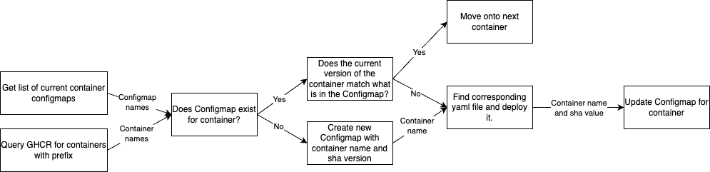
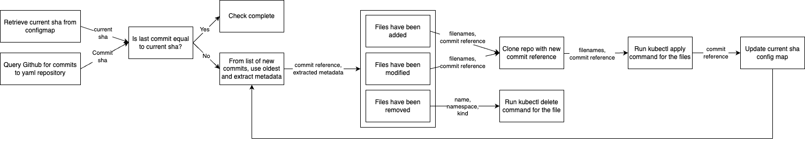
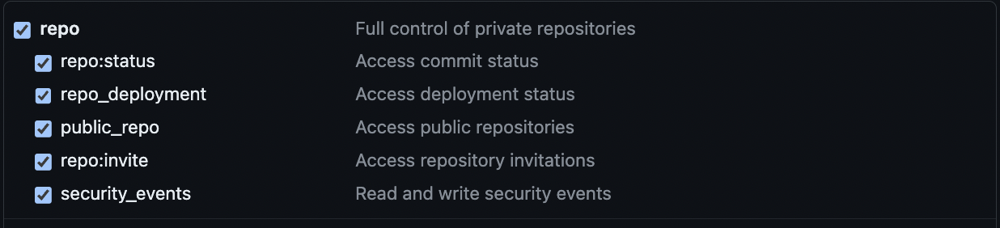
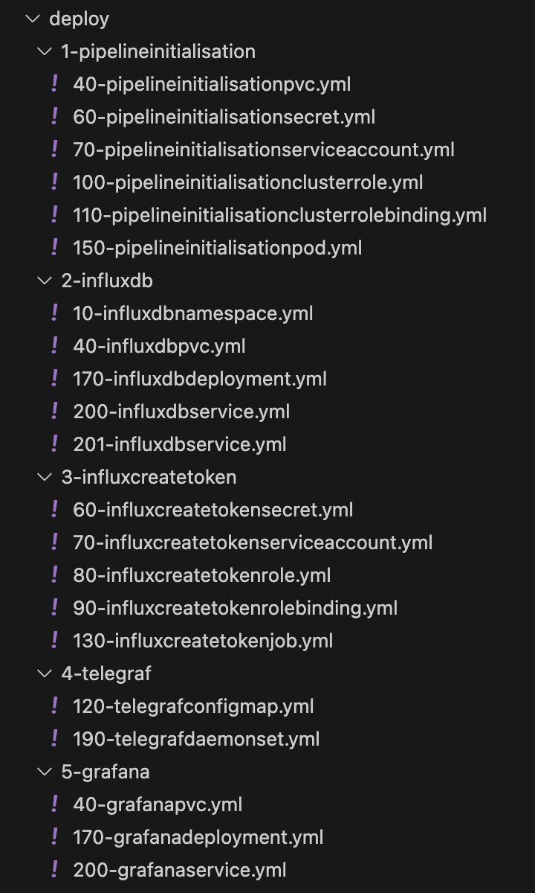

# Overview:

Like many people working with Kubernetes, when you're continuously deploying container updates or changing yaml for testing it can become very frustrating having to constantly run kubectl delete and apply commands. There are many pipelining tools available to automate this, but most require external access to your cluster. There are a few available like Argo or add-ons for Jenkins, but where's the fun in using an off the shelf product when you can build it yourself!

DORIS (Deployment of Operational Readiness Information Systems) is a micro-service designed to run inside a Kubernetes cluster to act as a Continuous Deployment (CD) pipeline. 

As I said, most pipelining tools require external access to your cluster. This means allowing external compute access to a Kubernetes cluster's network which would involve opening ports on firewalls or configuring peer-to-peer VPN tunnels. This adds complexity and potential risk to already complicated technologies and reduces ease of deployment, especially if edge based Kubernetes clusters are being deployed on mass.

I wanted to build a micro-service that would run inside the cluster that would be able to deploy all other components of the Kubernetes cluster, rather than relying on an external source. This then utilises pull, rather than push methods. Being part of the Kubernetes cluster it then also has the standard benefits of Kubernetes, including resiliency.

Currently DORIS is configured to work with GitHub as the code repository and GitHub Container Registry (GHCR) as the container registry. However, as long as there are equivalent APIs it can be adapted to work with any code repository or container registry.

In terms of the workflow, the following processes occur. These are simplified representation of what happens within the container versions and yaml commit functions.

Container Versions Check:


My workflow starts when I make an update to a script and commit this change to Github. GitHub Actions rebuilds the container and pushes the container to GHCR. The pipeline initialisation micro-service queries all container names and their version sha. If a change is detected then the corresponding yaml file is found for the deployment from the "deploy" folder, the old deployment is deleted and the new deployment is executed.  The process is implemented for deployments, pods, jobs, cronjobs, daemonsets, replicasets and statefulsets.

Yaml Commit Check:


This is pretty similar to the container versions check, but for the yaml repo. The commit shas for this repo are extracted, compared against the currently deployed sha which is stored in a ConfigMap and if the sha is different, inspect what changes have been made. For example, what files have been added, modified or removed. I run the relevant kubectl command and then update the saved current sha in a Kubernetes ConfigMap.


# How to Deploy Pipeline Micro-Service:

This explanation is assuming you're using the standard container I've published to GHCR. Your Kubernetes device must have an ARM64 v8 CPU architecture. If not you can build a custom version of the container with your compute architecture and then follow these instructions. 

The purpose of these steps is to deploy the pipelineinitialisation micro-service which is acting as your continuous deployment pipeline.

Create your own repository. This can be either public or private, although I would recommend private. The name of this repository is up-to-you, although I would recommend just having letters and no special characters. Clone the repository "dorisyamlscripts" and copy everything from it into your new repo so you have an exact copy.

In your new repository, go into the top level (the same level at this Readme) and create 3 additional files with names: "AdminNamespace.yml", "Secrets.yml" and "deploy.sh".

The "AdminNamespace.yml" file will look like this:

```yaml
apiVersion: v1
kind: Namespace
metadata:
  name: admin
```

This will create the Admin namespace in which the pipeline initialisation micro-service runs in. It is important in Kubernetes to segregate micro-services into different namespaces, depending on their functions and interactions. Out of practice, I don't deploy in the default namespaces (default, kube-node-lease, kube-public, kube-system), but always create a project specific one. This way, if I need to delete everything associated with the project I can just delete the namespace rather than delete all components individually. The only Kubernetes kind that is namespace-less are clusterroles.

The reason the file is not in the "deploy" folder is because this then makes it harder for it to be deleted. For example, if it was in the deploy folder and the file was accidently removed, then this would then delete the namespace and everything inside, including the pipeline initialisation micro-service. This would in effect completely sever the link to the edge device. This initial manual deployment process would have to be re-conducted which defeats the purpose of it. With the current method the Admin namespace could still be deleted by adding the yaml file into the deploy folder and then deleting it, but that definitely wouldn't be an "accidental" error. Having the file outside the deploy folder is the safer option here. 


The "Secrets.yml" file will look like this:

```yaml
apiVersion: v1
kind: Secret
metadata:
  name: variables-for-pipelineinitialisation
  namespace: admin
stringData:
  user-account: ironpayne22   #your github user name where your custom containers and cloned yaml repo are stored
  pvc-name: yamlfiles   #the pvc name that is specified in the 30-pipelineinitialisationpvc.yml file
  repo-name: deploymentscripts   #the name of your new cloned repository
  folder-name: deploy   #the name of the nested folder inside the new repo. This contains all deployable yaml files
  custom-container-prefix: solar   #project specific prefix for custom containers. Here, container names in GHCR must begin with 'solar-'
  pull-ghcr-image-token: abcd #if pulling custom images from private GHCR then you will need to generate a token from github
  clone-yaml-token: efgh   #if new repo is private you will need to generate a token from github to clone repo
  yaml-commit-checker-token: ijkl #if new repo is private you will need to generate a token from github to check commits on this new repo
  package-checker-token: mnop #if using custom images you will need to generate a token from github to check versions of custom images
```

For the last four lines you will need to generate access tokens through your github developer settings. 

The pull-ghcr-image-token is generated by the following technique. Create a token just for the following permission:


You then base64 encode your user and the token with the following shell command `echo -n 'username:token' | base64`

Create a new json file, copy in the json below and replace BASE64_ENCODED_STRING with the encoded string generated from above.

```json
{
  "auths": {
    "https://ghcr.io": {
      "auth": "BASE64_ENCODED_STRING"
    }
  }
}
```

Then run the shell command `cat config.json | base64`. This is assuming that your json file is saved as `config.json`.

The bottom three (clone-yaml-token, yaml-commit-checker and package-checker-token) are used to leverage Github's APIs.

Permissions for the bottom three can be combined into one role with the following permissions:


This Secrets file is outside of the deploy folder so that the Secrets are not in plain text in the PVC on the deployed edge Kubernetes cluster. This method ensures that the secrets are deployed in a secure manner.

If you are using an external secrets manager (e.g. Terraform Vault) for managing secrets in any of the other micro-services, an additional secret will need to be made in the "Secrets.yml" file with the namespace that the micro-service using the secret will be in. This would involved a manual re-deploy. Otherwise, if deployed automatically retrospectively, the secret will be in plain text in the cluster's cloned repo file system.

An improvement on the above code would be to have one secret string to allow a connection to a cloud based secrets manager. All other secret strings would then be contained in this cloud based secrets manager. This would allow for an easy secret string update process for each edge device if needed (plus no secrets in plain text or re-deployment processes). Implementation would greatly depend on which secrets manager was chosen and the interface mechanisms. This is currently out of scope for my personal projects.


The "deploy.sh" file will look like this:

```bash
#!/bin/bash

# export image_url_var="ghcr.io/ironpayne22/dorispipelineinitialisation:main@sha256:db9edb47b8f7681613f434e45efec8cb74238c6b9cff56f560b80e845475fa61" #latest version of pipeline initialisation image url     only if private
# export pull_ghcr_image_token="abcd"  #same token as above. Only needed if using private version of pipeline initialisation. 

kubectl apply -f "AdminNamespace.yml"
kubectl apply -f "Secrets.yml"

if [ -n "$pull_ghcr_image_token" ]; then
    kubectl apply -f "deploy/1-pipelineinitialisation/40-pipelineinitialisationpvc.yml"
    cat "deploy/1-pipelineinitialisation/60-pipelineinitialisationsecret.yml" | sed "s#pull_ghcr_image_token#${pull_ghcr_image_token}#g" | kubectl apply -f -
    kubectl apply -f "deploy/1-pipelineinitialisation/70-pipelineinitialisationserviceaccount.yml"
    kubectl apply -f "deploy/1-pipelineinitialisation/100-pipelineinitialisationclusterrole.yml"
    kubectl apply -f "deploy/1-pipelineinitialisation/110-pipelineinitialisationclusterrolebinding.yml"
    cat "deploy/1-pipelineinitialisation/170-pipelineinitialisationdeployment.yml" | sed "s#image_url_var#${image_url_var}#g" | kubectl apply -f -
else
    kubectl apply -f "deploy/1-pipelineinitialisation/40-pipelineinitialisationpvc.yml"
    kubectl apply -f "deploy/1-pipelineinitialisation/60-pipelineinitialisationsecret.yml"
    kubectl apply -f "deploy/1-pipelineinitialisation/70-pipelineinitialisationserviceaccount.yml"
    kubectl apply -f "deploy/1-pipelineinitialisation/100-pipelineinitialisationclusterrole.yml"
    kubectl apply -f "deploy/1-pipelineinitialisation/110-pipelineinitialisationclusterrolebinding.yml"
    kubectl apply -f "deploy/1-pipelineinitialisation/170-pipelineinitialisationdeployment.yml"
fi

echo "kubectl apply completed."
```

The above file is a bash script which will execute all the kubectl commands needed to deploy the standard pipeline initialisation deployment. If you are using a private copy of the pipeline initialisation image you have will have to keep the export pull_ghcr_image_token line. If you are using my public copy then this line can be deleted. The if statement in the bash will then run the other commands based on whether this variable is present in the shell.

Once you have added these additional files and made the relevant changes, DO NOT COMMIT THESE CHANGES TO YOUR NEW GITHUB REPO!! Otherwise all your secrets will be in plain text in your master branch and inside the cluster PVC.

To be able to do an initial deployment you will have to connect your local machine to the cluster and be able to run kubectl commands. This can be done either through ethernet or connect via a common WiFi network and then updating your kubeconfig file to include the context of the cluster. It is recommended that the cluster is a clean install. My test unit is currently running k3's, but I see no reason why this won't run on standard k8s or microk8s. To test connectivity run 'kubectl get namespaces'. This should return a list of default namespaces if working correctly.

If you've made a copy of the container and make it private, you will need to uncomment the following in the pod/deployment file: 

```yaml
imagePullSecrets:
- name: dockerconfigjson-github-com
```

Once you are connected to the cluster, navigate to your new repo via the terminal and run the deploy.sh file (./deploy.sh). Once this has run successfully, all future deployments and updates are now fully automated! If it doesn't work you may have to run chmod +x deploy.sh to give execute permissions before running ./deploy.sh


# How to Customise your Deployments:

Within the deploy folder, this contains all the yaml files that will be deployed. The sub-folders in the deploy folder have the name format "deployment order number"-"deployment name". The pipeline initialisation deployment will always have the number 1 so it is the very first thing to be deployed. The "deployment name" can be anything you want as it is not linked with anything. All other sub-folders must have this same format. For example, 2-influxdb, 3-telegraf, 4-grafana. Dependencies for other micro-services, such as databases, should be deployed first.

The sub-folders contains all the yaml files. In each of these yaml files there must only be one component and no --- lines separating components. Otherwise an issue occurs when reading the yaml file when a change has been made to that file. All yaml files have a number at the start. This determines the order of deployment of the files in this sub-folder. The standard numbering system for different kinds of Kubernetes components I have been using is as follows:

10-Namespace: Provides a way to partition and isolate resources within a cluster.  
20-Volume: Provides storage for Pods  
30-PersistentVolume (PV): Represents a piece of storage in the cluster  
40-PersistentVolumeClaim (PVC): Requests a specific amount of storage from a PersistentVolume  
50-StorageClass: Defines classes for dynamic provisioning of storage  
60-Secret: Stores sensitive data such as passwords and keys  
70-ServiceAccount: Defines an identity that pods can use to access cluster resources   
80-Role: Defines access controls at the namespace level   
90-RoleBinding:  Links a role to a service account at the namespace level  
100-ClusterRole: Defines access controls at the cluster level   
110-ClusterRoleBinding: Links a role to a service account at the cluster level   
120-ConfigMap: Stores configuration data as key-value pairs    
130-Job: Creates Job
140-CronJob: Creates Jobs on a schedule  
150-Pod: A single instance of a running process in a cluster  
160-ReplicaSet: Ensures a specified number of Pod replicas are running  
170-Deployment: Provides declarative updates to applications  
180-StatefulSet: Manages the deployment and scaling of a set of Pods with unique identities  
190-DaemonSet: Ensures that all Nodes run a copy of a Pod  
200-Service: Exposes a set of Pods as a network service  
210-Ingress: Manages external access to services, typically HTTP
220-Endpoint: Endpoint of a service

The lower numbered components are pre-requisites before the higher number components are deployed. The reason I have left a gap of 10 between each kind is to allow room for multiples of the same kind, plus allowing for retrospective additions. If required, this gap could be changed to 100, 200 or 1000 without any further changes needed elsewhere. This is only meant as an advisory guideline.

The naming convention for each of the yaml files is "deployment order number"-"container name""deployment kind".yml. For example, for deploying an influxdb container, the yaml file name would be 170-influxdbdeployment.yml. 170 is because it is a deployment and should be run later than other components, influxdb because that is the container name and deployment because it is a deployment kind.

If you are using a private/custom container then the container name is without the prefix that you specified in the Secrets.yml file. Also, just to note, in your custom container names, do not use _ or any special characters.

The pipeline initialisation can currently be run as either a pod or a deployment. All code is in the file. Please comment/uncomment as you see fit. Typically, when developing a new micro-service I use a "pod" yaml file so that when errors occur I can see them. From my experience, when errors occur when a service has been deployed with a "deployment" yaml file, the pod automatically restarts and hides the errors. For more production environments, deployments should be used.

For custom images, in the corresponding yaml deployment file (either deployments, pods, jobs, cronjobs, daemonsets, replicasets and statefulsets) there must be an app label. This label does not include the prefix that is specified in the Secrets yaml file.

Here the app in my private GHCR is called 'solar-influxcreatetoken'. However, because the prefix is 'solar' the app label is just 'influxcreatetoken'.

```yaml
apiVersion: batch/v1
kind: Job
metadata:
  name: create-influx-secret
  namespace: monitoring
  labels:
    app: influxcreatetoken
spec:
  template:
    spec:
      serviceAccountName: internal-kubectl
      containers:
      - name: createinfluxtoken
        image: image_url_var
        imagePullPolicy: Always
        securityContext:
         privileged: true
      imagePullSecrets:
       - name: dockerconfigjson-github-com-influx
      restartPolicy: Never
  backoffLimit: 3
```

These are the only changes that need to take place. Once you have fully populated your yaml files it will probably look something like this:



Once this has been completed the first time, any updates to the pipeline initialisation micro-service plus any other custom micro-services or yaml files will be conducted automatically.

Your custom containers and cloned repo must be in the same github account. We are not monitoring any standard containers from other accounts. You will have to manually update the yaml with a new image url if you are wanting to update one of these components. This will then trigger a re-deploy with the newer version specified.


## How Does it Work?

The initial challenge here was that kubectl commands cannot be run in standard bash docker containers. From previous projects I have experience with the python Kubernetes client libraries. My initial idea was to read the yaml files and convert the format to be compatible with python. However, this was getting more and more complicated and felt unfeasible. I then discovered the Bitnami Kubectl docker image. This has the ability of running kubectl commands directly inside a Bitnami container and meant that I only needed to convert one yaml file (for deploying a Bitnami Kubectl job) into python using the Kubernetes client library. This now forms the basis of the deployment framework.

As stated in the overview, GitHub is my code repository and GHCR is my container registry. Here we are utilising Github's APIs for:

1. Querying commits to the yaml repository
1. Querying container images in your GHCR
1. Querying the version of each of the container images in your GHCR.

Sha versions for the yaml repository and each of the container images are stored in ConfigMaps in the "Admin" namespace. These ConfigMaps are only updated after container updates occur so to make sure if a crash occurs mid update the container update will occur again before the ConfigMap is updated.

If multiple updates occur in the yaml repository before the update is detected in the micro-service, the updates occur in the order that the commits occured rather than doing the last commit first. The status of each file change is also read to see whether content has been added, removed or modified. The corresponding procedure is then executed and after the update, the newer version of the yaml repo is cloned to the PVC.

Every time a change is detected and a kubectl command is needed to be run, a new Bitnami Kubectl job is created with the specific kubectl command(s) embedded inside. For deployments, pods, jobs, cronjobs, daemonsets, replicasets and statefulsets, this job deletes the old version and then recreates the new one. This also applies to the pipelineinitialisation micro-service so that updates can happen to this service as well.

When a ConfigMap or Secret is updated in the yaml then the corresponding deployments, pods, jobs, cronjobs, daemonsets, replicasets or statefulsets yaml file containing either the ConfigMap or the Secret are deleted and recreated. This could be implemented for other components although I felt these were the most critical. If they weren't deleted, they would still use the old configuration.

GitHub has a limit of 5000 API Requests per account per hour and no more than 100 concurrent requests are allowed. This could potentially become an issue if your GitHub contains a lot of packages/images in your private GHCR and/or you have a lot of devices deployed, all of which are querying your GitHub account. This can be fixed in one of two ways. The first being to convert pipeline initialisation to a cronjob. This would involve changing the yaml file and making a minor change to the python code by removing the time.sleep() function and the while True loop at the bottom of the code. 

Alternatively, a central server could be set-up which queries GitHub for updates. Edge devices then query this central server for updates rather than GitHub to get around this issue. This would also be better for monitoring your network. Metadata from these requests could feed into a SIEM tool for analysis.


Accompanying repo: https://github.com/ironpayne22/dorisyamlscripts
